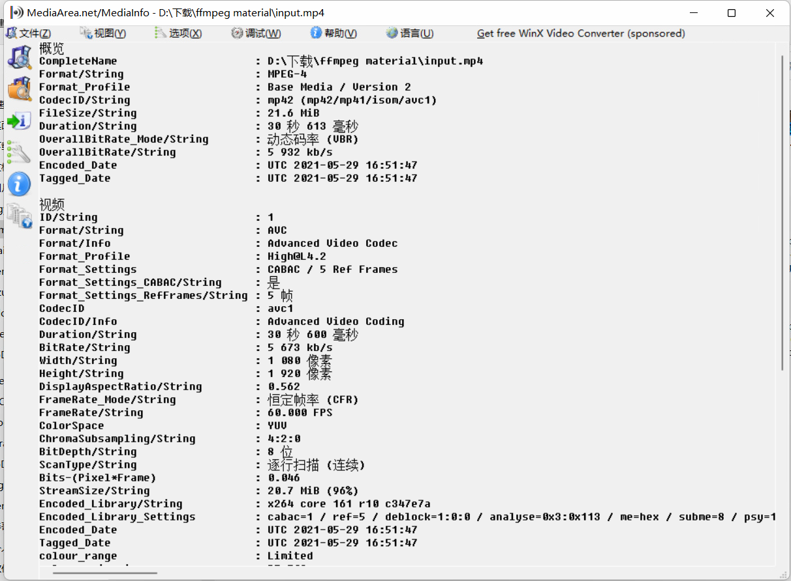
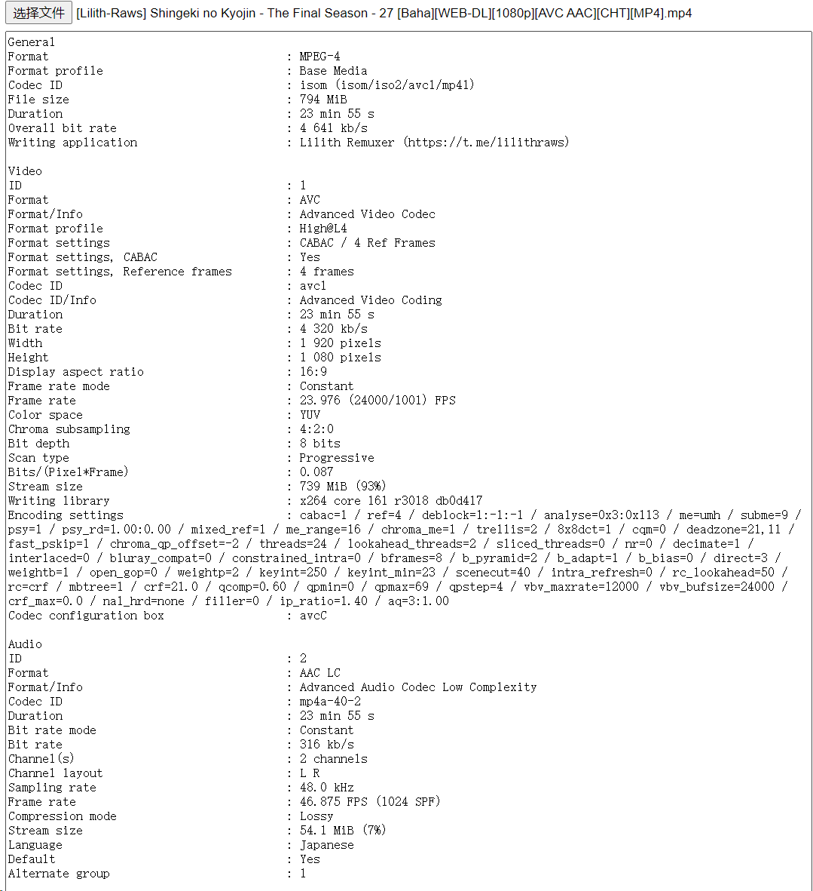
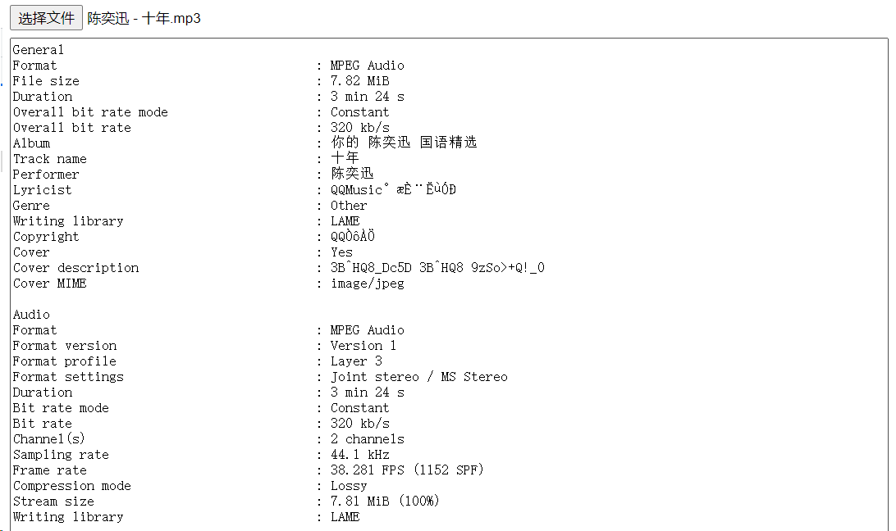
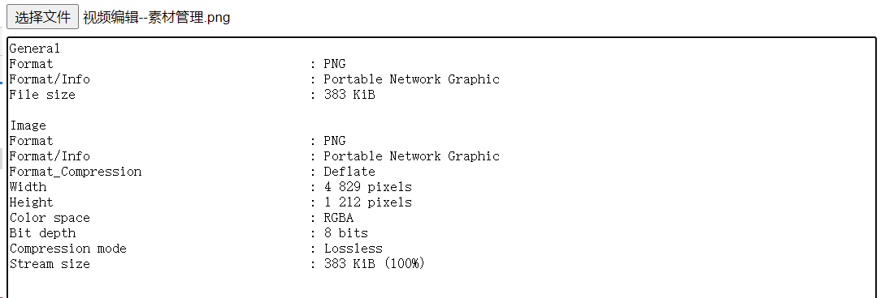
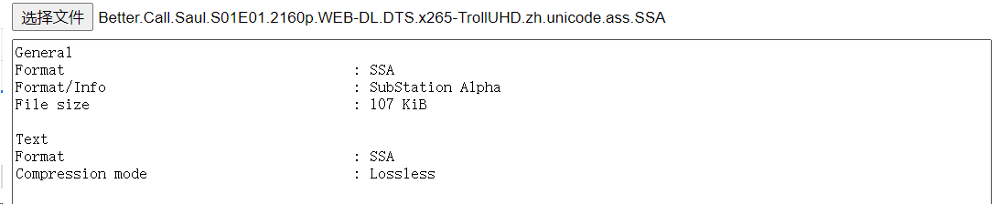

# 媒体信息库[mediainfo.js](https://github.com/buzz/mediainfo.js)

mediainfo.js是桌面软件mediainfo的web版，我看了下可以获取的信息非常全，没有仔细对比不过应该跟原桌面版的差不多；

原桌面版长这样

# 本示例运行效果

**视频文件：**

**音频文件：**

**图形文件：**

**文本文件：**

